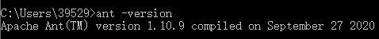
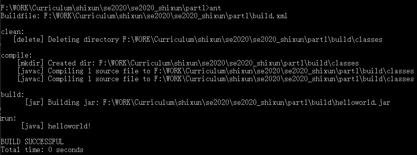
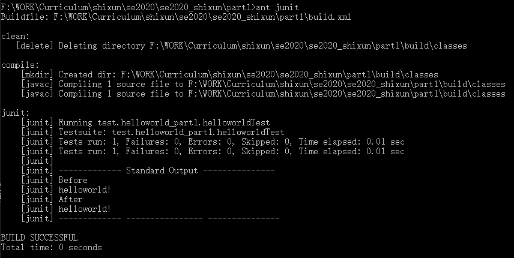
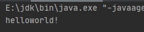
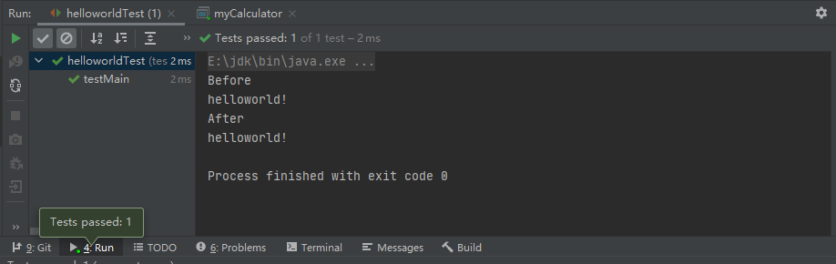
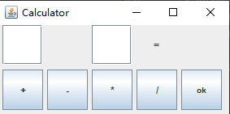
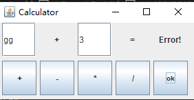
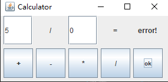
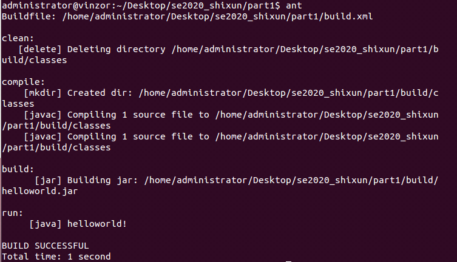

# Report-Part 1 
## 18342040 景致

本报告为 part 1 总结学习

-----

**1. Vi/Vim 的学习**  

本次实训第一个要求学的是 Vi/Vim 编辑器，其中 Vim 是一款基于 Vi 而升级得到的文本编辑器，这二者都算是远古时代的产品了（官方github repo: [link][vim_github]）。这也不是我第一次接触了，所有学习过 Linux 相关知识的都一定学过 Vi/Vim 的使用，比如我们都非常熟悉的 :q, :wq 指令等等。Vim 其实是发展于 Vi 的一个升级版本的编辑器，在 Vi 的基础上，增加代码补完、编译及错误跳转等方便编程等丰富的功能，在程序员中被广泛使用。在 Vim 中有很多很方便的快捷键，熟悉之后会大幅增加我们编辑代码的效率。  
Vi/Vim 有三个模式：命令行模式（command mode）、插入模式（Insert mode）和底行模式（last-line mode），使用的基本步骤是首先从 terminal 中使用 vim filename.txt 打开一个新的文本；接着就进入了命令模式，按下 i 进入开始插入编辑，可以按 esc 退回到命令模式；之后开始输入文本内容，完成之后，按下 esc 回到命令模式，通过一些指令完成保存退出等操作，比如 :w 会直接保存、:wq! 可以保存后退出、:q! 会直接退出。  
还有许多很方便的快捷键，这里列举一些我个人比较常用的快捷指令：  
```
j: 向下移动一行
k: 向上移动一行
h: 向左移动一个字符
l: 向右移动一个字符
Ctrl+f: 屏幕向下移动一页
Ctrl+b: 屏幕向上移动一页
Ctrl+d: 屏幕向下移动半页
Ctrl+u: 屏幕向上移动半页
(n)yy: 复制游标所在的那一行，可以在前面加上数字，则是复制该数字等量的行
(n)dd: 删除游标所在的那一整行，可以在前面加上数字，则是删除该数字等量的行
u: 复原前一个动作*
Ctrl+r: 重做上一个动作*
```  
最后两个操作是我个人用的最多的，类似于 windows 的 ctrl(+shift)+z 和 mac 的 cmd(+shift)+z，非常好用的撤回和重做指令。这就是 Vim 的简单操作，初尝会有些复杂，但是一旦快捷键熟悉之后会大幅提高工作效率，被许多程序员成为“上古神器”。

-----
**2. Java 学习**  

对于 Java 语言，我之前也有过相关的学习经历，选修过一门 Java 的程序设计课程。对于初学者常有的许多很头疼的问题，比如很多环境上的配置、语言的程序设计、Java 相关特色功能的使用等等，我还是比较熟悉的，本次实训中也没有给我造成太大的困扰。  
+ 首先来说说环境的配置。  

本次实训我主要是会在我自己的台式（windows 10）和笔记本（macOS 10.15.4）上进行整个项目的搭建，并不会很依赖云桌面的功能，因为一方面 macOS 也是类 Unix 系统，许多配置和操作跟 Linux（unbuntu） 基本一样，另一方面云桌面有些延迟的影响，对于开发工作很不方便。配置 java 的编译环境，也就一个关键点，就是 jdk 的安装：jdk 可以从官网直接下载，我的台式机下载的是 jdk 15 最新的版本。在这个版本中，jdk 安装好之后有一个选项可以直接帮你在环境变量中设置好 jdk\bin，JAVA_HOME；而在 mac 中，则本身就带有 jdk 和 Java SE，所以并不需要额外去下载。另外，在本次实验中，我主要会使用 IDEA 作为 IDE 来完成整个项目的搭建，它会自动检测环境变量中的 jdk 位置，所以也不需要额外的为之配置。

特别地，因为这次实训的云桌面是 ubuntu，这里简单说一下怎么设置环境变量：相对方便的是直接修改 .bash_profile 文件，用文本编辑器（可以用上文说到的 Vi/Vim）打开用户目录下的 .bash_profile 文件，在末尾加入（第一行要改成实际地址）：
```shell
export JAVA_HOME=/opt/jdk1.6.0_16
export PATH=$JAVA_HOME/bin:$PATH
export CLASSPATH=.:$JAVA_HOME/lib/dt.jar:$JAVA_HOME/lib/tools.jar
```
当然，在 ubuntu 环境下可以直接 apt-get，但是要注意先 upgrade/update 一下，另外也需要 sudo 来获得管理员权限。  最后在命令行里面输入
```
java -version
```
可以查看是否安装成功，比如在我的台式机上  
   
在笔记本上  
  
实训的 part1 更多的是在台式机上自己配置完成的。

- Java 介绍  

Java 是当前最火热的语言之一，常年制霸 TIOBE 榜榜首，它有几个重要特性：  
跨平台(可移植)：主要原因是：我们编写的Java源码，编译后会生成一种 .class 文件，称为字节码文件。JVM就是负责将字节码文件翻译成特定平台下的机器码然后运行。但是值得注意的是JVM不是跨平台的，JVM翻译出来的机器码也不是跨平台的。因此，跨平台的是Java程序，不是JVM，在不同的平台需要安装对应的JVM。  
面向对象：Java面向对象的三大特征：封装，继承，多态。封装可以起到很好的信息隐藏作用，隐藏实现细节。继承则可以使子类具有父类的一些基本成员和方法，也可以在父类的基础上扩展出一些新的功能。多态是允许将父对象设置成为和一个或更多的他的子对象相等的技术，简单来说就是允许父类指针指向子类，实现方法一般可以通过子类重写父类的一些方法。  
安全性：Java语言本身有提供很多安全性措施的支持。最主要的一个Java里面没有用指针，而且有内存回收机制，因此可以大大减少内存访问越界以及内存泄露的问题，还有万恶的野指针。另外因为Java支持网络编程，因此网络安全保护机制在Java中也是需要被重视的，Java也有一套独立的网络安全防范机制，尤其是针对有下载任务的时候。

- 小小尝试一下 Java  

其实对于我来说也不是新语言了，这里简单演示一下 helloworld 程序设计。首先 Java 和之前课程学习过的语言（C/C++）有一个最大的区别就在于所有的东西都是对象，全部要用 class 封装，所以我们首先建立一个 helloworld 的类，在里面我们完成 main 函数的设计。在 Java 里面，用于输出的函数为 System.out.print 或者  System.out.println （后者会自动换行）

```java
  public class helloworld
  {
      public static void main(String[] args)
      {
          System.out.println("helloworld!");
      }
  }        
```
然后我们在命令行输入 java helloworld.java 进行结果输出，可以看到我们成功的输出了 helloworld：  


----
 **3. Ant 学习**  

Ant 是 Java 的生成工具，类似于 Unix 中的 Make 工具用来编译、生成。在之前的操作系统、初级实现中我们是有学习过 Make 的（至今还记得读 GNU 的 manual 的痛苦），所以对于 Ant 的上手会相对容易一些。首先还是来看看环境的配置。
- 环境配置  

首先是从官网下载最新的版本 1.10.9 的压缩包，解压。完成之后，我们在环境变量中，把 ANT_HOME 设置为该解压后的文件夹路径，再将 path 里设置 %ANT_HOME%\bin 就可以完成环境变量的配置了。之后我们在命令中输入 ant -version 来检查是否配置成功，这里可以看到是成功了的：


- Ant 尝试

学习一个陌生的工具，最好的方法就是读它的白皮书或者 Manual，这里我给出 apache 官方给的 manual 的链接: [ant_link][ant]。  打开之后我们不需要整个读完，我们看到导航栏有一个 Tutorial 的选项，我们可以直接打开它，里面有一个 helloworld 的 step by step 教程，这里面是官方开发人员写的，每一步，什么作用，有什么拓展的方法都描述得十分清楚。  
经过学习，这里，我展示在 part1 中所用到的 build.xml 的设计过程：  
源文件为同一目录下的 build.xml，注意打开的时候要用 GBK 编码 encode 打开

```xml
<?xml version="1.0" encoding="GBK"?>

<project name="helloworld_part1" default="run" basedir=".">
```
这里第一句就是 xml 文件必须有的，描述了相关的配置信息；之后是整个项目的相关属性，name 为项目名，default 为默认的操作，basedir 为基目录的地址。
```xml
    <!-- 变量设置 -->
    <!-- 项目名 -->
    <property name="packagename" value="helloworld_part1"/>
    <!-- 项目名 -->
    <property name="filename" value="helloworld"/>
    <!-- 源代码src路径 -->
    <property name="src.path" value="src/${packagename}"/>
    <!-- 编译文件class路径 -->
    <property name="build.path" value="build/classes"/>
    <!-- 单元测试代码路径 -->
    <property name="test.path" value="src/test/${packagename}"/>
    <!-- lib包路径 -->
    <property name="lib.path" value="lib"/>
    <!-- jar包名称 -->
    <property name="jarname" value="${packagename}.jar"/>

    <!-- 设置classpath -->
    <path id="compile.path">
        <fileset dir="${lib.path}">
            <include name="**/*.jar"/>
        </fileset>
        <pathelement path="${build.path}"/>
    </path>
```
这里是在设置一系列的变量 property，方便后续代码的编写，具体的作用可以见注释，name 为 property 的属性名，value 为其值；之后是设置了一个 classpath，用于整合所有编译需要用到的文件路径。
```xml

    <!-- 清除历史编译class -->
    <target name="clean" description="clean">
        <delete dir="${build.path}"/>
    </target>

    <!-- 编译测试文件，初始化目录 -->
    <target name="compile" description="compile">
        <mkdir dir="${build.path}"/>
        <javac srcdir="${src.path}" destdir="${build.path}"  classpathref="compile.path"
               includeantruntime="true"/>
        <javac srcdir="${test.path}" destdir="${build.path}" classpathref="compile.path"
               includeantruntime="true" encoding="gbk"/>
    </target>

    <!--创建jar包，jarfile表示目录+文件名，basedir表示归档压缩进jar的文件-->
    <target name="build" depends="compile">
        <jar jarfile="build/${filename}.jar" basedir="${build.path}"/>
    </target>

    <!-- 执行测试案例 -->
    <target name="junit" depends="clean,compile">
        <junit printsummary="true">
            <formatter type="brief" usefile="false" />
<!--            <classpath refid="test.path"/>-->

            <classpath path="${build.path}">
                <path refid="compile.path"/>
            </classpath>

            <test name="test.helloworld_part1.helloworldTest"/>
        </junit>
    </target>

    <!-- 运行程序 -->
    <target name="run" depends="clean,compile,build">
        <java classname="${packagename}.${filename}" classpath="${build.path}"/>
    </target>

</project>
```
这里就是一系列要完成的操作（任务）了，name 为任务名，depends 为依赖，这个和 make 一样的，先执行依赖，再开始任务的操作。  
这就是 helloworld 的 build 文件的设计，我们来输出看看结果：  
- 首先用命令 ant （自动寻找目录下的 build.xml 并执行 default 设置的操作）  

- 我们再用 ant junit 来尝试测试：   


可以看到这里我成功的完成了任务。

-----
**4. JUnit 学习**  

JUnit是一个Java语言的单元测试框架，是属于 xUnit 的一个子集，但也是 xUnit 家族中最为成功的一个。JUnit有它自己的JUnit扩展生态圈。多数 Java 的开发环境都已经集成了 JUnit 作为单元测试的工具。JUnit 是一套基于测试驱动开发的测试框架，其断言机制可以将程序预期的结果与程序运行的最终结果进行比对，确保对结果的可预知性。 其优点比起手动调试非常明显：
- 提供测试预期结果的断言
- 为运行测试提供测试运行程序
- JUnit测试可以自动运行，并检查自己的结果并提供即时反馈。
- 无需手动梳理测试结果报告。
- JUnit测试可以组织到包含测试用例甚至其他测试套件的测试套件中，也就是其移植性非常好。

如果测试运行平稳，JUnit将在条形图中显示测试进度，当测试失败时，它会变为红色。
这个工具也不是完全陌生的了，之前课程中有用到不少，这里我也给出官方给出的 Manual 的地址: [JUnit_link][JUnit]。同样的，我们也不需要完全看完，我们看到导航栏有一个 basic usage，我们打开它可以进行最基础功能的学习。这里我展示一下我在 helloworld 里面所使用到的 test 的设计：
```Java
package test.helloworld_part1;

import helloworld_part1.helloworld;
import org.junit.Test;
import org.junit.Before;
import org.junit.After;
import static org.junit.Assert.assertEquals;


/**
 * helloworld Tester.
 *
 * @author <Authors name>
 * @version 1.0
 * @since <pre>10月 10, 2020</pre>
 */

public class helloworldTest {

    @Before
    public void before() throws Exception {
        System.out.print("Before\n");
    }

    @After
    public void after() throws Exception {
        System.out.print("After\n");
        helloworld h = new helloworld();
        h.sayhello();
    }

    /**
     * Method: main(String[] args)
     */
    @Test
    public void testMain() throws Exception {
    //TODO: Test goes here...
        helloworld h = new helloworld();
        assertEquals("helloworld!", h.sayhello());
    }
} 
```
其实设计上很容易理解，before 就是 test 开始时的输出，after 为待测程序的输出，二者进行 assertEquals 的对比，如果不同，该断言函数就会抛出错误。  
JUnit 还给出了很多丰富的功能：赛程（Fixtures）、测试套件(Test suites)、试跑者(Test runner)、JUnit 类(Junit classes)，可以让我们更好的对程序进行设计和测试。

----
**5. 提交代码成果**

- helloworld  
上文已经有展示过 windows 命令行下用 Ant 的运行结果了，这里展示直接在 IDEA 的运行结果：   
  
  

- calculator
这里直接展示运行结果：   
  
程序测试：  
  
   
  


- Robustness Test  
由于 Java 本身就有很好的可移植性和鲁棒性，所以这一点没有造成很大的困扰，同样的程序我们放在云桌面上运行也是没有问题的：  



[vim_github]:https://github.com/vim/vim
[ant]:http://ant.apache.org/manual/index.html
[JUnit]:http://www.tutorialspoint.com/junit/junit_quick_guide.htm